# Arena Progression — Canonical Sequence Document

**Status:** Canonical reference. This document is the authoritative description of how Arena Progression (Phase F, F1 onward) moves data through the system — every future Arena progression feature (new bonus types, new modes, new reward categories) should be implemented consistent with what's described here, and this document should be updated if the flow changes, rather than left to drift.

**Depends on:**
- `docs/arena-phase-f-design.md` (architecture + Phase F0.5 validation) — this document assumes that design and does not re-derive it.
- Phase F0.6 foundation hardening (this session): `XpService`'s internal P2034 retry (`backend/src/modules/leaderboard/xp-transaction-retry.util.ts`) and the shared critical-event-handler helper (`backend/src/common/events/critical-event-handler.util.ts`).

**Baseline verified**: Phase A–E, Phase F Design, Phase F0.5 Validation, Phase F0.6 Foundation Hardening — all complete before this document was written.

---

## 1. Complete sequence diagram

```mermaid
sequenceDiagram
    participant Client
    participant ArenaController
    participant ArenaService
    participant Postgres as Postgres (finalizeMatch tx)
    participant ArenaProgressionService
    participant XpService
    participant PostgresXp as Postgres (XpService Serializable tx)
    participant EventEmitter as EventEmitter2
    participant AchievementsListener
    participant AchievementQueue as BullMQ: achievement-processing
    participant AchievementsProcessor
    participant NotificationPublisher as NotificationEventPublisher
    participant NotificationListener as NotificationEventListener
    participant NotificationQueue as BullMQ: notifications
    participant NotificationsProcessor
    participant ArenaGateway
    participant ReconciliationScheduler as ArenaRewardReconciliation (Cron)

    Client->>ArenaController: POST /arena/rooms/:roomId/finish
    ArenaController->>ArenaService: finishMatch(userId, roomId)
    ArenaService->>Postgres: BEGIN (existing CAS-guarded tx, unchanged)
    Postgres-->>ArenaService: winnerTeam computed, ArenaMatch.finishedAt set
    ArenaService->>Postgres: COMMIT
    ArenaService-->>ArenaController: match result (still status 200 at this point)

    Note over ArenaService,ArenaProgressionService: NEW in Phase F1 — runs after commit, not inside it (F0.5-1 correction)
    loop for each participant (sequential)
        ArenaService->>ArenaProgressionService: applyMatchRewards(matchId, userId)
        ArenaProgressionService->>XpService: awardXpWithSideEffects({sourceType:ARENA, idempotencyKey}, sideEffects)
        XpService->>PostgresXp: BEGIN Serializable
        alt P2034 serialization conflict
            PostgresXp-->>XpService: P2034
            XpService->>XpService: withSerializableRetry — backoff, retry (internal, Phase F0.6)
            XpService->>PostgresXp: BEGIN Serializable (retry)
        end
        PostgresXp-->>XpService: sideEffects(tx) runs: ArenaProfile mmr/gold/trophy write, ArenaRatingHistory row, ArenaRewardLog upsert
        XpService->>PostgresXp: XpTransaction row created, LeaderboardEntry.periodXp bumped if season active
        PostgresXp-->>XpService: COMMIT
        XpService-->>ArenaProgressionService: {duplicated:false, transaction, sideEffectResult}
        ArenaProgressionService-->>ArenaService: tier-change flag (if any)
    end

    ArenaService->>EventEmitter: emit(ARENA_MATCH_FINISHED)  [existing, unchanged]
    ArenaService->>EventEmitter: emit('arena.match.completed') per participant [new]
    opt tier changed for a participant
        ArenaService->>EventEmitter: emit(ARENA_RATING_CHANGED) [new]
    end

    EventEmitter->>AchievementsListener: @OnEvent('arena.match.completed')
    AchievementsListener->>AchievementsListener: runCriticalEventHandler(logger, eventName, handler)
    AchievementsListener->>AchievementQueue: queue.add(PROCESS_EVENT, payload, {jobId, attempts:3, backoff:exponential})
    AchievementQueue->>AchievementsProcessor: process(job)
    AchievementsProcessor->>Postgres: processActivityEvent (AchievementProcessedEvent unique guard)
    opt achievement unlocked, title/badge-granting
        AchievementsProcessor->>NotificationPublisher: publish(ARENA_TITLE_UNLOCKED)
    end

    EventEmitter->>NotificationPublisher: (rating-changed listener) publish(ARENA_TIER_PROMOTED | ARENA_TIER_DEMOTED)
    NotificationPublisher->>EventEmitter: emit(NOTIFICATION_DOMAIN_EVENT)
    EventEmitter->>NotificationListener: @OnEvent(NOTIFICATION_DOMAIN_EVENT)
    NotificationListener->>NotificationQueue: queue.add(CREATE_FROM_EVENT, {jobId:deduplicationKey})
    NotificationQueue->>NotificationsProcessor: createFromEvent(job)
    NotificationsProcessor->>Postgres: Notification.create (unique [recipientUserId,deduplicationKey])
    NotificationsProcessor->>ArenaGateway: (via NotificationGateway) emitCreated(userId, payload) [realtime, best-effort]

    ArenaService->>ArenaGateway: ArenaEventPublisher.publish(ARENA_MATCH_FINISHED) realtime snapshot push [existing]

    Note over ReconciliationScheduler: Independent of the above — runs on its own Cron schedule
    ReconciliationScheduler->>Postgres: find FINISHED matches missing ArenaRewardLog for a participant
    opt gap found
        ReconciliationScheduler->>ArenaProgressionService: applyMatchRewards(matchId, missingUserId) — same idempotent call as above
    end
```



---

## 2. Component responsibilities

| Component | Owns | Does NOT own |
|---|---|---|
| `ArenaService.finalizeMatch()` | Winner computation, `ArenaMatch.finishedAt` CAS flip. **Unchanged since Phase E/BC-Reconciliation.** | XP, MMR/tier, gold/trophy writes, achievement/notification triggering — all moved to `ArenaProgressionService`, invoked *after* this method's own transaction commits. |
| `ArenaProgressionService` (new, F1) | Per-participant post-commit loop; computes `computeMatchXp`/`resolveArenaTier`/`getArenaKFactor`; calls `XpService.awardXpWithSideEffects()` once per participant; publishes `arena.match.completed` and (if applicable) `ARENA_RATING_CHANGED`. | Does not open its own `$transaction` for the reward write — that transaction belongs to `XpService` (see §3). Does not talk to BullMQ, Notifications, or Achievements directly — those are reached only via `EventEmitter2.emit()`. |
| `XpService` (existing, hardened in F0.6) | The **only** writer of `XpTransaction`/`UserXpProfile`; owns the Serializable transaction and its own P2034 retry; provides the `sideEffects(tx)` hook every caller (achievements, missions, learning-path, Arena) uses to write its own domain data atomically alongside the XP grant. | Does not know what "Arena," "achievement," or "mission" means beyond `XpSourceType` — domain-specific writes live entirely inside the caller-supplied `sideEffects` callback. |
| `ArenaEventPublisher` | Realtime, best-effort event fan-out (`ARENA_ROOM_UPDATED`, `ARENA_MATCH_STARTED`, `ARENA_MATCH_FINISHED`, and the new `ARENA_RATING_CHANGED`) via `EventEmitter2.emit()`. | Does not guarantee delivery, does not retry, does not persist anything. A dropped realtime event only costs a missed live UI update — the next `getRoom`/`getMyProfile` fetch or reconnect snapshot always reflects true state. |
| `AchievementsListener` / new Arena-equivalent listeners | Subscribing to a "critical" event and immediately, safely (via `runCriticalEventHandler`) enqueueing a durable BullMQ job. Must do **no other work** synchronously. | Does not process the achievement logic itself — that's `AchievementsProcessor`'s job, off the queue. |
| `NotificationEventPublisher` / `NotificationEventListener` / `NotificationsProcessor` | Durable notification creation: publish → queue → DB row (deduped by `[recipientUserId, deduplicationKey]`) → realtime push. Existing, unmodified — Arena is just a new set of `NotificationEventType` values flowing through the same pipe. | Does not know anything about Arena-specific business logic — only receives a fully-formed event payload. |
| `ArenaRewardReconciliationScheduler` (new, F1) | Finds `FINISHED` matches with a missing `ArenaRewardLog` row for any participant (crash/partial-failure recovery, see §6/§7) and re-invokes `ArenaProgressionService.applyMatchRewards()` for just the gap. | Does not re-verify or recompute already-successful participants' rewards — idempotency guarantees re-invocation for an already-rewarded participant is a safe no-op, but the scheduler's query specifically targets only the missing ones to avoid needless work. |

---

## 3. Transaction boundaries

Exactly **three** kinds of transaction are involved per match-finish, and they are never nested inside one another:

1. **`finalizeMatch`'s existing transaction** (unchanged) — winner computation, `ArenaMatch.finishedAt` CAS. Scope: the whole match, all participants, one commit.
2. **`XpService`'s Serializable transaction — one per participant, per `awardXpWithSideEffects()` call.** Scope: that one participant's `XpTransaction` + `UserXpProfile` + `LeaderboardEntry` (if a season is active) + whatever `ArenaProgressionService`'s `sideEffects(tx)` callback writes (that participant's `ArenaProfile` mmr/gold/trophy, `ArenaRatingHistory` row, `ArenaRewardLog` row). **Not** shared with transaction 1, **not** shared across participants — this is the corrected shape from Phase F0.5 (F0.5-1): `XpService.awardXpWithSideEffects()` cannot be nested inside another `$transaction()` call, so it must be the outermost transaction for its own scope.
3. **`ArenaSeasonCloseService`'s per-season-close transaction** (F2, not yet implemented) — out of scope for this document's sequence beyond noting it exists and follows the same "own transaction, not nested" rule.

**Everything downstream of an `EventEmitter2.emit()` call is intentionally outside all three** — publish-after-commit discipline, unchanged from the existing `ArenaEventPublisher` convention. A slow or failed achievement/notification side effect can never roll back a match result or an XP grant.

---

## 4. Event flow

Two event tiers, formalized in this phase (Phase F0.6) as the platform-wide standard — see the audit in §"Domain event standard" below for why two tiers, not a single new dispatch class:

| Tier | Mechanism | Delivery guarantee | Used for |
|---|---|---|---|
| **Realtime** | `EventEmitter2.emit()`, consumed by a listener that does UI-facing work only (socket push) | Best-effort, fire-and-forget. A miss costs a stale UI until the next fetch/reconnect. | `ARENA_ROOM_UPDATED`, `ARENA_MATCH_STARTED`, `ARENA_MATCH_FINISHED`, `ARENA_RATING_CHANGED`'s socket push, `arena:season:ended` socket push. |
| **Critical** | `EventEmitter2.emit()` at the publish site, but **every listener** immediately hands off to a durable BullMQ queue, wrapped in `runCriticalEventHandler()` (`backend/src/common/events/critical-event-handler.util.ts`) | Durable once enqueued — BullMQ's own `attempts`/`backoff`/persistence takes over; the only loss window is the (sub-millisecond, in-process) gap between `emit()` and the listener's `queue.add()` call, mitigated by keeping listener bodies trivial (enqueue only, no business logic). | `arena.match.completed` → achievement processing; `ARENA_RATING_CHANGED`/`ARENA_SEASON_ENDED`/etc. → notification publishing. |

**Naming convention** (formalized, applies to all future Arena — and non-Arena — critical events):
- EventEmitter2 event names: dot-case, present-tense-or-past-participle, `<domain>.<subject>.<verb>` (e.g. `arena.match.completed`, `learning.activity.completed`).
- `Achievement.eventType` / `AchievementActivityEvent.eventType` catalog-matching strings: `SCREAMING_SNAKE_CASE`, `<DOMAIN>_<SUBJECT>_<VERB>` (e.g. `ARENA_MATCH_COMPLETED`, `VOCABULARY_COMPLETED`). **These are two different strings for two different purposes** (event-bus routing vs. catalog-row matching) — never assume they're interchangeable (this was an ambiguity in the original Phase F design draft, corrected in F0.5 finding F0.5-7).
- `NotificationEventType` enum values: `SCREAMING_SNAKE_CASE`, `<DOMAIN>_<EVENT>` (e.g. `ARENA_TIER_PROMOTED`, matching the existing `ACHIEVEMENT_UNLOCKED`/`MISSION_COMPLETED` convention).

### Domain event standard — what was audited and why this shape

Audited: `ArenaEventPublisher` (realtime-only), `AchievementsListener` (critical, EventEmitter2→BullMQ), `NotificationEventPublisher` (critical, EventEmitter2→BullMQ, single fixed consumer), Leaderboard (`LeaderboardRealtimeGateway` — **bypasses EventEmitter2 entirely**, called as a plain injected method, e.g. `xp.service.ts`'s `this.gateway.emitGroupUpdated(...)` called inline), Missions-v2 (`MissionV2ProgressService.increase()` — **also bypasses EventEmitter2**, called directly by ~7 different feature services, idempotency via a Prisma unique constraint on `MissionProgressEventV2`, not BullMQ jobId dedup), Community (`CommunityGateway` — bypasses EventEmitter2 like Leaderboard; but there IS a `community-jobs` BullMQ queue, enqueued directly via `queue.add()` from services, not via an event bus), Analytics (confirmed: zero event usage, pure read/report layer), and every `@Processor` in the codebase (8 found: `CommunityProcessor`, `AchievementsProcessor`, `WritingProcessor`, `NotificationsProcessor`, `LeaderboardWeeklyCloseProcessor`, `ListeningJobProcessor`, `PlacementProcessingProcessor`, `SpeakingProcessingProcessor` — failure-logging via `@OnWorkerEvent('failed')` was present in only 4 of 8 before this phase).

**Finding**: the codebase does not have one dominant pattern — it has three genuinely different, coexisting styles: (a) EventEmitter2-based pub/sub (Arena, Achievements, Notifications, LearningXp), (b) direct injected-method calls with no event bus at all (Leaderboard's realtime gateway, Community's realtime gateway, Missions-v2's progress writes), and (c) BullMQ used directly from a service without any EventEmitter2 involvement (Community's queue).

**Decision**: do **not** retroactively migrate (b) or (c) onto EventEmitter2 — those are already-shipped, working, tightly-scoped call sites where the caller and callee are 1:1 and known at compile time; forcing them through an event bus would add indirection without adding value, and retrofitting three unrelated, already-tested modules is out of scope for "hardening the foundation Arena builds on." Instead: **formalize (a) as the mandatory pattern for every future cross-module domain event** (which is what all of Arena Progression's new events are), with the two-tier realtime/critical split above, and the `runCriticalEventHandler` helper to eliminate duplicated try/catch boilerplate across critical listeners. `AchievementsListener` was refactored onto this helper in this phase as the reference implementation (behavior-preserving — see Part C of the final report).

**Also fixed in this phase**: `AchievementsProcessor` was missing `@OnWorkerEvent('failed')` (4 of 8 processors lacked it) — added, matching the shape already used by `WritingProcessor`/`ListeningJobProcessor`/`SpeakingProcessingProcessor`, since Arena's achievement integration depends on this exact processor. The other 3 processors still missing it (`CommunityProcessor`, `NotificationsProcessor`, `PlacementProcessingProcessor`) are **out of scope** for this Arena-focused hardening pass — flagged here as known, pre-existing, unrelated technical debt for a future general cleanup, not silently ignored.

---

## 5. Retry flow

**Only one retry mechanism exists in this whole flow, and it lives inside `XpService`** (Phase F0.6, `backend/src/modules/leaderboard/xp-transaction-retry.util.ts`):

```
withSerializableRetry(run, { maxAttempts, baseDelayMs, logger }):
  for attempt in 1..maxAttempts:
    try: return await run()
    catch e:
      if not isSerializationFailure(e) or attempt == maxAttempts: throw e
      delay = baseDelayMs * 2^(attempt-1) + random(0, baseDelayMs)   # exponential backoff + jitter
      logger?.warn("P2034, retrying...")
      await sleep(delay)
```

- Triggers only on Prisma error code `P2034` (Postgres serialization failure under `Serializable` isolation). Every other error (including `P2002`, the pre-existing idempotency-race handler in `awardXpWithSideEffects`) is untouched and propagates through the existing, unmodified catch logic.
- Configurable via `XP_SERIALIZABLE_RETRY_MAX_ATTEMPTS` (default 4) and `XP_SERIALIZABLE_RETRY_BASE_DELAY_MS` (default 25ms) environment variables — no code change needed to tune retry aggressiveness per environment.
- Applies transparently to **both** `awardXp()` and `awardXpWithSideEffects()`, and therefore to `reverseTransaction()` too (which calls `awardXp()` internally) — every existing XP caller (achievements, learning-path, learning-xp, the leaderboard admin endpoint) gets this retry for free, with **zero code changes required on their part** (verified via `xp.service.spec.ts`'s regression tests).
- **Arena implements no retry logic of its own.** `ArenaProgressionService` simply calls `XpService.awardXpWithSideEffects()` per participant and lets it retry internally — this was an explicit, non-negotiable requirement of Phase F0.6 ("Arena must simply call XpService").
- Safety of retrying a whole transaction from scratch: a `P2034` means Postgres rolled back **everything** from the failed attempt — no partial writes survive it. The `sideEffects(tx)` callback (where `ArenaProgressionService` writes `ArenaProfile`/`ArenaRatingHistory`/`ArenaRewardLog`) may therefore run more than once per outer call, but only the successful attempt's writes ever commit. This requires `sideEffects` to have no effects outside `tx` (no external HTTP calls, no direct non-transactional Redis writes) — already true for every planned Arena side effect.

**No retry exists (by design) for**: EventEmitter2 `emit()` calls (not retryable — they're synchronous fan-out, not I/O), or BullMQ job processing itself (that's `attempts`/`backoff` configured per-job at `.add()` time, e.g. achievement jobs use `attempts: 3, backoff: {type:'exponential', delay:3000}` — a separate, already-existing mechanism, unrelated to the P2034 retry above).

---

## 6. Recovery flow

Two independent recovery mechanisms, for two independent failure classes:

1. **Crash mid-transaction (single participant)**: fully handled by transaction atomicity + idempotency. If the process crashes during `XpService`'s transaction for participant N, nothing commits for that participant (Postgres rolls back). The next time anything re-triggers `ArenaProgressionService.applyMatchRewards()` for that participant (the reconciliation scheduler, §7) it is a clean, idempotent re-attempt — `awardXpWithSideEffects`'s idempotency-key pre-check (`arena:xp:<matchId>:<userId>`) and `ArenaRewardLog`'s `@@unique([matchId,userId])` guarantee it can't double-apply.
2. **Crash between participants (partial match completion)**: `finalizeMatch`'s own transaction (winner computation) already committed — the match IS finished, correctly, regardless of what happens next. But if the process crashes after rewarding participant 1 and before participant 2, participant 2 has no `ArenaRewardLog`/`XpTransaction` yet. Nothing in the request path re-triggers this automatically — this is what the reconciliation scheduler (§7) exists for.

**Realtime-layer crash recovery** (unchanged, pre-existing, not part of this phase): Gate D-Recovery's `ArenaPresenceService`/disconnect-grace/`forfeitParticipant` machinery, and the room-preparation state machine's stale-`PREPARING` CAS reclaim (Phase BC-Reconciliation) — both untouched by Phase F, both already proven (131/131 Arena tests).

---

## 7. Reconciliation flow

```
ArenaRewardReconciliationScheduler (@Cron, same poll-and-let-the-DB-decide idiom as LeaderboardWeeklyCloseScheduler):
  every N minutes:
    gaps = SELECT p.userId, p.roomId, m.id as matchId
           FROM ArenaParticipant p
           JOIN ArenaMatch m ON m.roomId = p.roomId
           WHERE m.finishedAt IS NOT NULL
             AND m.finishedAt > now() - lookbackWindow   -- bounded scan, not full-table
             AND NOT EXISTS (
               SELECT 1 FROM ArenaRewardLog r
               WHERE r.matchId = m.id AND r.userId = p.userId
             )
    for each gap (bounded batch, not unbounded):
      ArenaProgressionService.applyMatchRewards(gap.matchId, gap.userId)
      -- idempotent: if this participant actually did get rewarded and only
      -- the query missed it (race with an in-flight legitimate call), the
      -- idempotency key / unique constraint makes the re-attempt a no-op.
```

- **No new table required** — `ArenaRewardLog` (`@@unique([matchId,userId])`, already exists) is the checkpoint. This was an explicit Phase F0.5 finding (F0.5-6): the reconciliation job needs a "what's missing" signal, and the existing reward-log table already provides one.
- Bounded lookback window (e.g. last 24–48h) to keep the scan cheap — a match older than that with a permanent gap is a signal for manual/alerting investigation, not silent infinite retry.
- This scheduler is **new, required F1 scope**, not an optional nice-to-have — it is the direct consequence of choosing per-participant transaction boundaries (§3) over a single cross-participant transaction, and without it, Phase F0.5's correction would silently reintroduce a data-loss risk under crash.

---

## 8. Idempotency keys

| Key | Shape | Guards against |
|---|---|---|
| XP grant | `arena:xp:<matchId>:<userId>` (`XpTransaction.idempotencyKey`, unique) | Duplicate XP award to the same participant for the same match (retry, reconciliation re-run, duplicate `finalizeMatch` trigger). |
| Reward log | `ArenaRewardLog` unique on `[matchId, userId]` (existing, Phase A) | Duplicate mmr/gold/trophy application — the same underlying guarantee as the XP key, at the Arena-currency layer. |
| Reversal | `reverse:<sourceTransactionId>` (`XpService.reverseTransaction`'s own convention, existing, unchanged) | Double-reversal of the same XP transaction. |
| Achievement processing | `AchievementProcessedEvent` unique on `[userId, achievementId, eventId]`; `eventId` for Arena = `<matchId>:<userId>` (match-scoped) or `<seasonId>:<userId>` (season-scoped achievements) | Duplicate achievement unlock/progress from a replayed or duplicated domain event. |
| Achievement BullMQ dedup | `jobId: payload.eventId` on `queue.add()` | Duplicate BullMQ job for the same event (separate, cheaper first line of defense before the `AchievementProcessedEvent` DB-level guard). |
| Notification | `Notification` unique on `[recipientUserId, deduplicationKey]`; Arena's `deduplicationKey`s: `arena:tier:<userId>:<matchId>`, `arena:season-end:<userId>:<seasonId>`, `arena:season-reward:<userId>:<rewardId>`, `arena:title:<userId>:<achievementId>`, `arena:badge:<userId>:<achievementId>` | Duplicate notification delivery from a replayed event or a duplicate `NotificationEventPublisher.publish()` call. |
| Notification BullMQ dedup | `jobId: deduplicationKey` on the notification queue's `.add()` call | Same purpose as the achievement BullMQ dedup, one layer earlier. |

Every key above is **deterministic, derived from IDs already flowing through the system** — no new UUID-generation-and-store step anywhere, matching the convention established since Gate E's power-up `clientRequestId` scheme.

---

## 9. BullMQ jobs

| Queue | Job name | Producer | Consumer | Options |
|---|---|---|---|---|
| `achievement-processing` (existing) | `PROCESS_EVENT` | `AchievementsListener` (now via `runCriticalEventHandler`), triggered by both `learning.activity.completed` (existing) and the new `arena.match.completed`/`ARENA_RATING_CHANGED` (F1+) | `AchievementsProcessor` | `jobId: eventId`, `attempts: 3`, `backoff: {type:'exponential', delay:3000}`, `removeOnComplete: 1000`, `removeOnFail: 500` — unchanged, reused as-is |
| `notifications` (existing) | `CREATE_FROM_EVENT` | `NotificationEventListener`, triggered by the new `ARENA_TIER_PROMOTED`/`ARENA_TIER_DEMOTED`/`ARENA_SEASON_ENDED`/`ARENA_SEASON_REWARD_GRANTED`/`ARENA_TITLE_UNLOCKED`/`ARENA_BADGE_UNLOCKED` (F1/F2/F3) alongside existing types | `NotificationsProcessor` | `jobId: deduplicationKey` — unchanged, reused as-is |
| `arena-reward-reconciliation` (new, F1) | (single recurring job, no per-item queueing — the scheduler processes gaps in-process within its own bounded batch, matching `LeaderboardWeeklyCloseScheduler`'s "cron enqueues one dedup'd job per tick, the job itself does the work" shape) | `ArenaRewardReconciliationScheduler` (`@Cron`) | `ArenaRewardReconciliationProcessor` (new) | `jobId`: bucketed timestamp (e.g. 5-minute bucket, same dedup idiom as `LeaderboardWeeklyCloseScheduler`) |
| `arena-season-close` (new, F2, not yet implemented) | (same shape as above) | `ArenaSeasonCloseScheduler` (`@Cron`) | `ArenaSeasonCloseProcessor` (new) | same idiom |
| `arena-rating-decay` (new, F1/F2 per design doc §2.3) | (same shape) | Daily `@Cron` | new processor | same idiom |

No existing queue is repurposed or renamed — every Arena job is additive.

---

## 10. Realtime events

| Event | Transport | Guarantee |
|---|---|---|
| `ARENA_ROOM_UPDATED`, `ARENA_MATCH_STARTED`, `ARENA_MATCH_FINISHED` | `ArenaEventPublisher` → `ArenaRealtimeListener` → Socket.IO room snapshot push (existing, unchanged) | Best-effort — the per-user snapshot on next `getRoom`/reconnect is always correct regardless. |
| `arena:rating:changed` (socket event name, new) | Pushed alongside the match-finished snapshot when a participant's tier changed | Best-effort, low-latency path for the promotion/demotion animation (Part 9 of the design doc) — the `Notification` row (durable, via the critical tier) remains the source of truth for any offline user. |
| `arena:season:ended` (socket event name, new, F2) | Pushed once at season close if the user has an active connection | Best-effort — same rationale as above. |
| `notification:created` / unread-count push (existing, unchanged) | `NotificationsProcessor` → `NotificationGateway` → Socket.IO, automatic on every successful `Notification.create()` | This is the durable-notification realtime layer — happens after the DB row is persisted, so it's a strict superset of "the user will see it" (either live now, or on next app open via the unread list). |

---

## 11. Future extension points

| Feature | Impact on this sequence | Redesign needed? |
|---|---|---|
| **2v2 / 3v3** | Already structurally supported — `ArenaProgressionService`'s per-participant loop iterates however many participants a match has (2, 4, or 6); ELO already computes per-team-average (existing `finalizeMatch` logic, untouched). | No. |
| **Tournament** | A bracket has multiple `ArenaMatch` rows under one larger construct. The capability registry's new `affectsElo`/`grantsXp` fields (design doc §2.3/F0.5-5) already provide the extension point: a `TOURNAMENT` mode could set `affectsElo:false` per-match and instead apply a placement-based reward once at bracket completion, reusing the same `ArenaProgressionService.applyMatchRewards()` entry point with a different `sourceId`/`idempotencyKey` shape (`arena:xp:tournament:<bracketId>:<userId>` instead of `<matchId>`). | No — registry extension, not a new mechanism. Needs the `ArenaRoom.contextType/contextId` columns (design doc Part 7, F0.5-8) to tag which bracket a room belongs to. |
| **Guild Wars** | No guild/clan system exists anywhere in the schema today — this is the one genuine gap (F0.5-8). `ArenaRoom.contextType='GUILD_WAR'`/`contextId=<warId>` gives a forward-compat tagging hook, but the actual guild/membership/scoring aggregation is new infrastructure, a future phase's own design, not an extension of this sequence. | Yes, but scoped to a new guild module — this sequence's event/reward/reconciliation flow is reusable underneath it once that module exists (a guild-war match is still "a match," still flows through §1–§9 unchanged; only the aggregation *above* individual matches is new). |
| **Spectator** | Orthogonal — already blocked at `getRoom` (`ForbiddenException` for non-participants). Spectators don't participate in `ArenaProgressionService`'s loop (it iterates `ArenaParticipant` rows, and a spectator is never one). | No. |
| **Replay** | Would read `ArenaQuestion`/`ArenaAnswer`/`ArenaBattleEvent` (Gate E's existing audit-trail tables) plus, once F1 ships, `ArenaRatingHistory` for "what did my rating do during this match" — all already-persisted, already-immutable data. A replay viewer is a read-only projection over existing tables. | No new write-path involvement; purely additive read endpoints in a future phase. |
| **Mobile App** | This entire sequence is transport-agnostic on the write side (REST + realtime-socket-push, both already consumed by the existing Next.js frontend) — a mobile client calls the same `ArenaController` endpoints and connects to the same Socket.IO namespace. `NotificationGateway`'s existing `notification:created` push and any future push-notification channel (APNs/FCM) would hook in at the same point `NotificationsProcessor` already creates a durable `Notification` row — an additive delivery channel, not a new event/data path. | No — this sequence's server-side shape does not assume a particular client. |

---

## Verification performed for this document

This document's every claim about existing code (transaction shapes, event mechanisms, processor inventory, idempotency guards) was verified by reading the actual source referenced, not inferred from memory — consistent with this whole session's standing rule that "the source code on disk is the source of truth." Phase F1 implementation should treat any divergence between this document and the code it describes as a signal to stop and reconcile, not to silently follow whichever one is more convenient.
